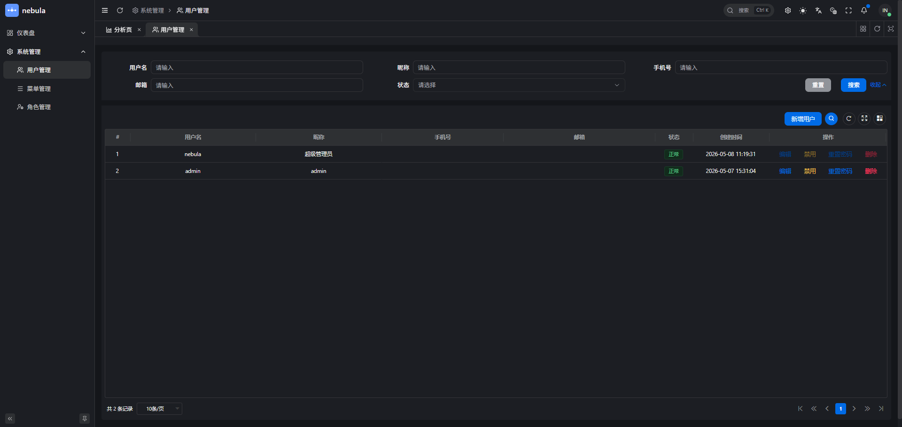
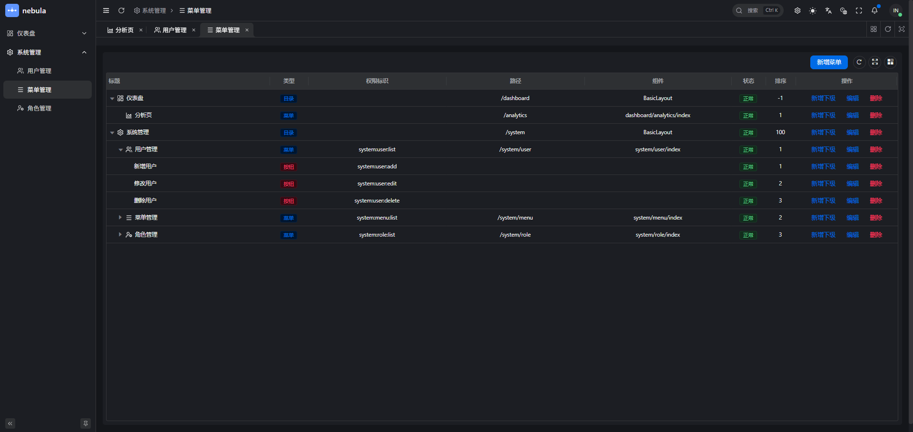
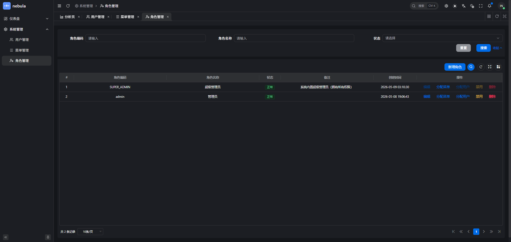

# Nebula

Nebula 是一个企业级的全栈开发框架，由后端 Java 微服务架构、前端 Vue 3 管理系统和博客项目组成。它提供了一套完整的解决方案，用于快速构建高效、可扩展的应用系统。

## 🌟 特性

- **模块化架构** - 基于 Maven 的模块化设计，清晰的项目结构
- **企业级框架** - 提供 SDK、启动器、API 和服务等完整的开发套件
- **现代前端** - 基于 Vue 3 + TypeScript + Vite 的高效前端框架
- **Monorepo 管理** - 使用 Turbo 管理前端多个应用
- **博客项目** - 新增独立博客前端，支持内容展示和文档站点能力
- **类型安全** - 完整的 TypeScript 类型系统
- **开发友好** - 丰富的开发工具和自动化流程

## 📁 项目结构

```
nebula/
├── nebula-parent/          # 父项目 - Maven 配置管理
├── nebula-bom/            # Bill of Materials - 依赖版本管理
├── nebula-sdk/            # SDK 库 - 核心功能库
├── nebula-starters/       # 启动器 - 快速开发启动配置
├── nebula-apis/           # API 定义 - 接口和数据模型
├── nebula-services/       # 服务实现 - 业务逻辑实现
└── ui/                    # 前端项目
    ├── nebula-ui/         # Vue 3 管理系统
    │   ├── apps/
    │   │   ├── web-ele/   # Element UI 前端应用
    │   │   └── ...
    │   └── packages/      # 共享包和工具库
    └── nebula-blog-ui/    # Vue 3 博客项目
```

## 🚀 快速开始

### 后端项目

**前置要求：**
- Java 8+
- Maven 3.6+

**编译构建：**

```bash
# 进入项目目录
cd nebula

# 编译项目
mvn clean install

# 运行特定服务
cd nebula-services
mvn spring-boot:run
```

### 前端管理系统

**前置要求：**
- Node.js 20.19.0+ 或 22.18.0+ 或 24.0.0+
- pnpm 10.0.0+

**安装依赖：**

```bash
cd ui/nebula-ui
pnpm install
```

**开发模式：**

```bash
# 启动所有应用开发服务
pnpm dev

# 启动特定应用（web-ele）
pnpm dev:ele
```

**构建生产版本：**

```bash
# 构建所有应用
pnpm build

# 构建特定应用（web-ele）
pnpm build:ele
```

### 博客项目

**前置要求：**
- Node.js 20.19.0+ 或 22.18.0+ 或 24.0.0+

**安装依赖：**

```bash
cd ui/nebula-blog-ui
npm install
```

**开发模式：**

```bash
# 启动博客开发服务
npm run dev

# 启动博客文档站
npm run docs:dev
```

**构建生产版本：**

```bash
# 构建博客项目
npm run build

# 构建博客文档站
npm run docs:build
```

## 📦 可用命令

### 前端管理系统命令

| 命令 | 说明 |
|------|------|
| `pnpm bootstrap` | 安装依赖 |
| `pnpm dev` | 启动开发服务 |
| `pnpm build` | 构建生产版本 |
| `pnpm lint` | 执行代码检查 |
| `pnpm format` | 格式化代码 |
| `pnpm test:unit` | 运行单元测试 |
| `pnpm test:e2e` | 运行 E2E 测试 |
| `pnpm check:type` | 检查类型 |
| `pnpm check:dep` | 检查依赖 |

### 博客项目命令

| 命令 | 说明 |
|------|------|
| `npm run dev` | 启动博客开发服务 |
| `npm run build` | 构建博客生产版本 |
| `npm run preview` | 预览博客生产版本 |
| `npm run docs:dev` | 启动博客文档站开发服务 |
| `npm run docs:build` | 构建博客文档站 |
| `npm run docs:preview` | 预览博客文档站 |

## 💻 技术栈

### 后端

- **框架** - Spring Boot / Spring Cloud
- **构建** - Maven
- **语言** - Java

### 前端

- **框架** - Vue 3
- **构建工具** - Vite
- **语言** - TypeScript
- **样式** - Tailwind CSS
- **UI 框架** - Element Plus
- **包管理** - pnpm
- **Monorepo 管理** - Turbo
- **测试** - Vitest + Playwright
- **代码检查** - ESLint + Oxlint + Stylelint
- **博客能力** - md-editor-v3 + VitePress + Three.js

## 🔗 主要模块说明

### nebula-sdk
核心功能库，提供基础工具类、通用接口和常用的工具方法。

### nebula-starters
提供一系列 Spring Boot Starter，简化项目配置和快速集成。

### nebula-apis
定义项目的 API 接口和数据传输对象（DTO）。

### nebula-services
实现具体的业务逻辑和服务功能。

### ui/nebula-ui
前端管理系统，采用 Monorepo 架构管理多个前端应用。

### ui/nebula-blog-ui
博客前端项目，基于 Vue 3、TypeScript 和 Vite 构建，提供博客内容展示、编辑器集成和文档站点能力。

## 📸 界面预览

### 前端管理系统

**用户管理**


**菜单管理**


**角色管理**


## 🔧 开发指南

### 提交代码

```bash
# 使用交互式提交
pnpm commit

# 或直接 git 提交
git commit -m "feat: add new feature"
```

### 代码规范检查

```bash
# 执行所有检查（类型、依赖、代码检查、拼写）
cd ui/nebula-ui
pnpm check

# 自动修复格式问题
pnpm format
```

### 依赖更新

```bash
cd ui/nebula-ui
pnpm update:deps
```

## 📝 许可证

本项目采用 [LICENSE](./LICENSE) 许可证。

## 🤝 贡献指南

欢迎提交 Issue 和 Pull Request！

1. Fork 本仓库
2. 创建特性分支 (`git checkout -b feature/AmazingFeature`)
3. 提交更改 (`git commit -m 'Add some AmazingFeature'`)
4. 推送到分支 (`git push origin feature/AmazingFeature`)
5. 开启 Pull Request

## 📞 联系方式

如有问题，欢迎通过以下方式联系我们：

- 提交 Issue
- 发送邮件至相关负责人

## 🙏 致谢

感谢 [vben](https://github.com/vbenjs/vue-vben-admin) 提供的优秀前端框架和设计理念。

## 📚 更多资源

- [前端管理系统文档](./ui/nebula-ui/README.md)
- [博客项目文档](./ui/nebula-blog-ui/README.md)
- [后端项目文档](./docs/)

---

**当前版本**
- 后端：v1.0.1
- 前端：v1.0.1
- 博客：v1.0.1
