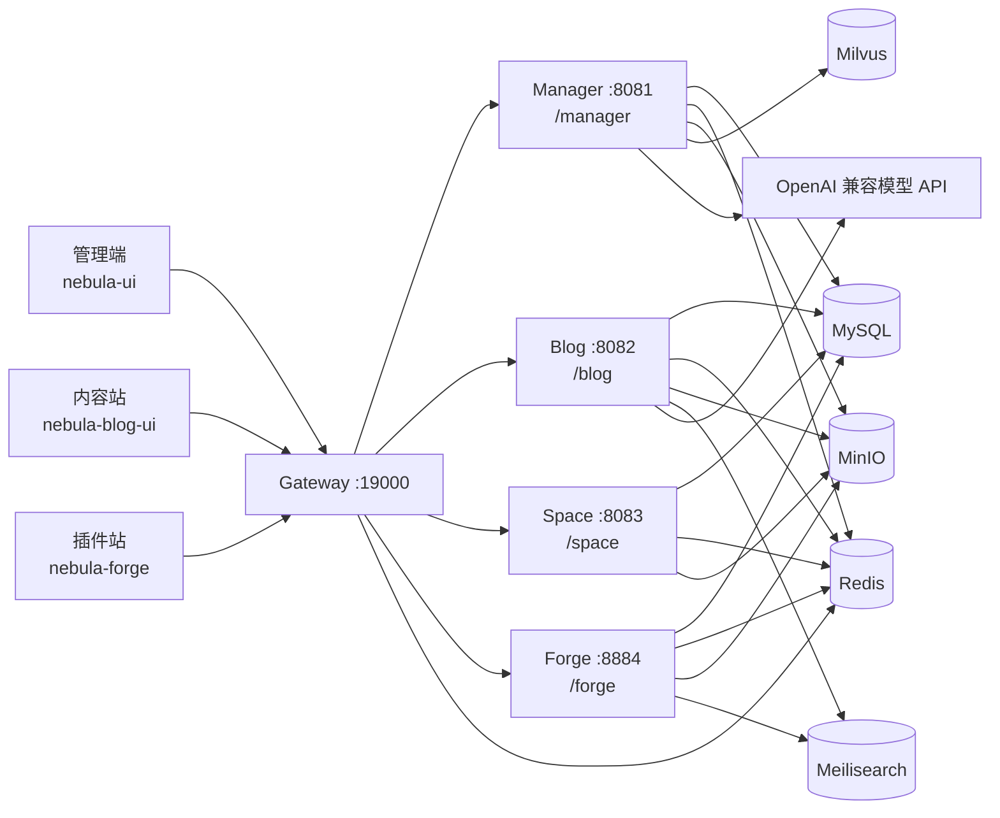

# Nebula

Nebula 是一个基于 Java 21、Spring Boot 4 和 Vue 3 的模块化全栈平台。项目从后台权限脚手架逐步演进为包含统一管理、AI 流程与 Agent、内容发布、个人空间、插件生态和多端前端的应用集合。

本文档只承担仓库总览和开发入口职责。具体部署参数、架构决策和专题设计分别维护在 [`deploy/`](./deploy/README.md) 与 [`docs/`](./docs/) 中。

## 项目状态

| 项目 | 当前状态 |
|---|---|
| 开发版本 | `1.0.4-SNAPSHOT`，以根目录 [`pom.xml`](./pom.xml) 的 `revision` 为准 |
| 最新发布标签 | `release-v1.0.3`（2026-09-19） |
| Java 基线 | Java 21 / Spring Boot 4.0.6 / Spring Cloud 2025.1.1 |
| 默认统一入口 | `http://localhost:19000` |
| 核心部署范围 | Gateway、Manager、Blog；Space 与 Forge 作为扩展服务启用 |

前端应用拥有各自的 `package.json` 版本，不与后端 `revision` 强制保持一致，因此不再使用“后端 / 前端 / 博客同版本”的旧式版本声明。

## 核心能力

- **统一管理**：认证、用户、角色、菜单、权限和文件管理。
- **AI 工作台**：模型档案、Prompt、Tool、Skill、MCP、知识库、对话、流程编排、Agent 运行和跨实例迭代。
- **内容与旅行**：文章、分类、标签、系列目录、旅行目的地与行程管理，并提供独立内容站。
- **个人空间**：书签、文件夹、标签以及书签导入、导出任务。
- **插件生态**：插件、分类、版本、审核、评论、收藏、安装和下载记录。
- **AI 基础组件**：OpenAI 兼容模型接入、Flow、Harness、RAG、Milvus 向量检索和长期记忆。
- **多形态部署**：支持业务服务独立运行，也支持 `manager / blog / space / forge` 单 JVM 聚合运行。

## 系统架构



管理端、内容站与插件站均通过相对路径 `/api` 访问后端。开发环境由 Vite 将 `/api` 代理到 Gateway；生产环境需要由 Nginx 或其他入口服务完成同源反向代理。

`nebula-scribe` 当前默认使用 Mock 数据，Gateway 暂无 `/scribe/**` 路由，因此它不在上面的已接通链路中。

## 仓库导航

| 路径 | 职责 |
|---|---|
| `nebula-parent/` | Java 版本、Spring 生态和 Maven 插件的统一父配置 |
| `nebula-bom/` | Nebula 内部 SDK、Starter 和 API 的依赖版本管理 |
| `nebula-sdk/` | 通用领域模型、Web、Redis、MyBatis、OSS、搜索及 AI 基础能力 |
| `nebula-starters/` | Web、安全、Redis、MyBatis、文件等 Spring Boot Starter |
| `nebula-apis/` | Manager、Blog、Forge 的 DTO、VO 和枚举契约 |
| `nebula-services/` | Gateway 与各业务服务实现，以及单进程聚合启动器 |
| `nebula-agents/` | Agent 扩展聚合模块；当前尚未包含子模块 |
| `ui/` | 管理端、内容站、插件站、写作端和布局设计稿 |
| `script/mysql/` | 合并后的 MySQL 初始化脚本 |
| `deploy/` | Docker Compose、镜像、环境模板和部署脚本 |
| `docs/` | AI、流程、Agent、向量检索、写作与部署设计文档 |

### 后端服务

| 模块 | 端口 | 路由前缀 | 主要职责 |
|---|---:|---|---|
| `nebula-service-gateway` | `19000` | - | 统一入口、路由转发和登录态校验 |
| `nebula-service-manager` | `8081` | `/manager` | 系统管理、AI 配置、流程、Agent、知识库和文件 |
| `nebula-service-blog` | `8082` | `/blog` | 文章、系列、旅行内容和 AI 中转信息 |
| `nebula-service-space` | `8083` | `/space` | 书签、文件夹、标签及导入导出 |
| `nebula-service-forge` | `8884` | `/forge` | 插件市场、版本、审核、评论和安装下载 |
| `nebula-service-all` | 多端口 | 保持原前缀 | 在一个 JVM 中启动四个业务服务，不包含 Gateway |

### 前端应用

| 路径 | 用途 | 开发命令 | 默认端口 | 状态 |
|---|---|---|---:|---|
| `ui/nebula-ui` | 统一管理端，pnpm + Turbo Monorepo | `pnpm dev:ele` | `5777` | 已接入 Gateway |
| `ui/nebula-blog-ui` | 内容、系列与旅行前台 | `npm run dev` | `28256` | 已接入 Gateway |
| `ui/nebula-forge` | 插件市场与插件开发文档 | `npm run dev` | `28257`，文档 `5174` | 已接入 Gateway |
| `ui/nebula-scribe` | AI 辅助写作端 | `npm run dev` | `28259` | 开发中，默认 Mock |

## 环境要求

| 工具或服务 | 建议版本 / 说明 |
|---|---|
| JDK | 21 |
| Maven | 3.9+ |
| Node.js | 推荐 `22.22.0`；管理端同时支持 `20.19+`、`22.18+`、`24+` |
| pnpm | 管理端使用 `10.33.0`，最低 `10.0.0` |
| npm | Blog 与 Forge 已提交 `package-lock.json`；Scribe 暂未锁定包管理器 |
| Docker | Docker 23+ 与 Docker Compose v2，用于中间件和部署 |
| 基础设施 | MySQL、Redis、MinIO、Meilisearch |
| AI 与向量能力 | OpenAI 兼容模型服务；按需接入 Embedding 服务与 Milvus |

生产编排当前使用 MySQL 8.4、Redis 7.4、MinIO 和 Meilisearch 1.11。确切镜像与资源限制以 [`deploy/docker-compose.yml`](./deploy/docker-compose.yml) 为准。

## 快速开始

### 1. 准备本地基础设施

本地配置默认连接以下地址：

| 服务 | 默认地址 |
|---|---|
| MySQL | `127.0.0.1:13306` |
| Redis | `127.0.0.1:16379` |
| MinIO | `127.0.0.1:9000` |
| Meilisearch | `127.0.0.1:7700` |

1. 创建 MySQL 数据库 `nebula`，导入 [`script/mysql/nebula.sql`](./script/mysql/nebula.sql)。
2. 准备 MySQL 和 Redis，或通过环境变量覆盖服务配置中的默认连接地址。
3. MinIO 与 Meilisearch 可使用本地开发编排启动：

```bash
docker compose -f deploy/docker-compose.dev.yml up -d
```

4. 如需 AI、Embedding 或向量检索，再配置相应 API 与 Milvus；配置项可参考 [`deploy/.env.example`](./deploy/.env.example)。Manager 当前默认启用 Milvus，本地没有可用实例时，启动前应设置 `MILVUS_ENABLED=false`。

### 2. 构建并启动后端

```bash
# 在仓库根目录构建全部后端模块
mvn clean install -DskipTests

# 终端 1：启动系统管理服务
mvn -f nebula-services/nebula-service-manager/pom.xml spring-boot:run

# 终端 2：启动网关
mvn -f nebula-services/nebula-service-gateway/pom.xml spring-boot:run
```

Blog、Space 和 Forge 可按同样方式从各自的 `pom.xml` 启动。Gateway 路由到尚未启动的服务时，对应路由不可用，但不影响其他服务。

各业务服务使用独立配置名：`nebula-manager.yml`、`nebula-blog.yml`、`nebula-space.yml` 和 `nebula-forge.yml`；Gateway 使用 `application.yml` 与 `gateway-routes.yml`。

### 3. 启动管理端

```bash
cd ui/nebula-ui
pnpm install
pnpm dev:ele
```

访问 `http://localhost:5777`。`pnpm dev` 是应用选择器，并不是同时启动全部应用；当前可运行应用为 `web-ele`。

### 4. 启动独立前端

以下项目依赖彼此隔离，需要分别安装：

```bash
# 内容站
cd ui/nebula-blog-ui
npm ci
npm run dev

# 插件站和 VitePress 文档站
cd ../nebula-forge
npm ci
npm run dev

# 写作端（当前无 lockfile，默认使用 Mock 数据）
cd ../nebula-scribe
npm install
npm run dev
```

## 构建与检查

| 工作目录 | 命令 | 用途 |
|---|---|---|
| 仓库根目录 | `mvn test` | 运行全部后端测试 |
| 仓库根目录 | `mvn -pl nebula-services/nebula-service-manager -am clean package -DskipTests` | 构建指定服务及其内部依赖 |
| `ui/nebula-ui` | `pnpm check` | 循环依赖、依赖、类型和拼写检查 |
| `ui/nebula-ui` | `pnpm test:unit` | 管理端单元测试 |
| `ui/nebula-ui` | `pnpm build:ele` | 构建管理端应用 |
| `ui/nebula-blog-ui` | `npm run build` | 构建内容站 |
| `ui/nebula-forge` | `npm run build` | 构建插件站及其文档 |
| `ui/nebula-scribe` | `npm run build` | 构建写作端 |

管理端还提供 `pnpm lint`、`pnpm format`、`pnpm test:e2e` 和 `pnpm commit` 等命令，完整列表以 [`ui/nebula-ui/package.json`](./ui/nebula-ui/package.json) 为准。

## 配置约定

- 根目录 `pom.xml` 的 `revision` 是后端模块的统一版本源。
- 后端环境差异通过环境变量覆盖各服务 YAML 中的属性，不复制多套配置文件。
- Gateway 路由统一维护在 `nebula-service-gateway/src/main/resources/gateway-routes.yml`。
- 生产部署从 `deploy/.env.example` 复制配置，真实的 `deploy/.env` 不应提交到仓库。
- `AI_PROFILE_SECRET` 用于加密模型档案中的 API Key；产生数据后不可随意更换。
- Embedding 维度必须与 Milvus Collection 一致，变更前阅读 [向量检索迁移 Runbook](./docs/设计文档/向量检索迁移runbook.md)。
- 独立前端生产构建仍请求相对路径 `/api`，部署时必须配置同源反向代理；不要依赖尚未接线的 `VITE_API_BASE_URL` 占位值。

## 部署

部署目录提供拆分核心服务、拆分全量服务（`--extra`）和单 JVM 聚合（`--all-in-one`）三种运行方式，详细说明见 [`deploy/README.md`](./deploy/README.md) 和 [当前部署架构](./docs/部署方式/当前部署架构.md)。

> **当前注意事项**：数据库脚本已合并为 `script/mysql/nebula.sql`，但 `deploy/scripts/init-db.sh` 仍引用合并前的多文件列表，导致 `deploy.sh` 在数据库初始化阶段退出。在初始化脚本同步之前，不要直接将其用作一键部署；临时部署需要绕过该生成脚本并手动导入合并 SQL。

## 文档索引

| 主题 | 文档 |
|---|---|
| 智能体运行模型 | [智能体设计](./docs/设计文档/智能体设计.md) |
| Agent Harness | [Agent Harness 设计](./docs/设计文档/AgentHarness设计.md) |
| 对话式流程生成 | [对话式流程生成与 Agent 派生设计](./docs/设计文档/对话式流程生成与Agent派生设计.md) |
| 多智能体协作 | [多智能体协作层设计](./docs/设计文档/多智能体协作层设计.md) |
| 计划与执行 | [计划-执行节点设计](./docs/设计文档/计划-执行节点设计.md) |
| 向量检索 | [Milvus 基建设计](./docs/设计文档/向量检索基建（Milvus）设计.md) |
| 写作 Agent | [写作 Agent 设计](./docs/设计文档/写作Agent设计.md) |
| 部署 | [部署套件](./deploy/README.md) / [部署架构](./docs/部署方式/当前部署架构.md) |

## 版本演进

| 版本 | 日期 | 主要里程碑 |
|---|---|---|
| `release-v1.0.0` | 2026-05-13 | 用户、角色、菜单与权限管理基础能力 |
| `release-v1.0.1` | 2026-05-30 | 新增博客功能 |
| `release-v1.0.2` | 2026-07-09 | 新增 AI 驱动、Agent 编辑与插件管理后台 |
| `release-v1.0.3` | 2026-09-19 | 完成本阶段 AI Flow、Harness、RAG、内容站、Space、Forge、Scribe 与部署体系建设，补充 Milvus URI 配置 |
| `1.0.4-SNAPSHOT` | 开发中 | 开始下一阶段迭代 |

发布新版本时，应同步根 `pom.xml`、部署镜像版本默认值和 Git 标签；详细变更以 Git 提交和发布标签为准。

## 许可证与致谢

本项目基于 [Mozilla Public License 2.0](./LICENSE) 发布。

管理端基于 [Vben Admin](https://github.com/vbenjs/vue-vben-admin) 的工程体系演进，感谢原项目及其贡献者。
