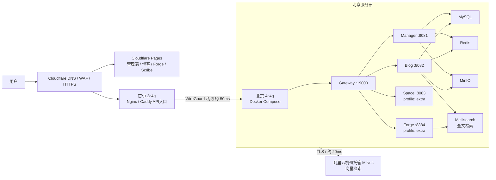

# Nebula 当前部署架构

> **配套实现**：本文档描述架构决策与取舍，可执行的编排文件、脚本和配置模板在
> [`deploy/`](../../deploy/README.md) 目录。两者不一致时以 `deploy/` 下的实际配置为准。
>
> ```bash
> cp deploy/.env.example deploy/.env && vi deploy/.env
> ./deploy/scripts/deploy.sh        # 构建 + 启动 + 健康验证
> ./deploy/scripts/health.sh        # 巡检
> ```

## 1. 适用范围

本文档用于当前开源示例项目的部署，不以高可用、异地容灾或数据恢复为目标。当前约束如下：

- 北京服务器：`4c4g`。
- 首尔服务器：`2c4g`。
- 域名使用 Cloudflare，暂不考虑 ICP 备案。
- 阿里云杭州提供免费的托管 Milvus 测试实例，容量 `5GB`。
- 首尔到北京延迟约 `50ms`，北京到杭州 Milvus 延迟约 `20ms`。
- 不部署 Nacos，不做两地双活，不做备份（数据可丢失，重新部署即可）。

## 2. 总体拓扑



### 2.1 首尔服务器

首尔服务器只承担公网入口职责：

- Cloudflare 的源站。
- Nginx 或 Caddy。
- API 请求转发到北京 Gateway。
- 可选：保存少量运维脚本和临时构建文件。

首尔不运行 MySQL、Redis、MinIO 或完整 Java 服务栈，以避免 `2c4g` 内存不足。

### 2.2 北京服务器

北京服务器是应用和数据节点，使用 Docker Compose 运行。各服务的 `context-path` 与网关路由前缀一致，健康检查路径包含该前缀：

| 服务 | 端口 | context-path | 健康检查 | 启动 profile |
|---|---|---|---|---|
| `nebula-service-gateway` | `19000` | — | `/actuator/health` | 默认 |
| `nebula-service-manager` | `8081` | `/manager` | `/manager/actuator/health` | 默认 |
| `nebula-service-blog` | `8082` | `/blog` | `/blog/actuator/health` | 默认 |
| `nebula-service-space` | `8083` | `/space` | `/space/actuator/health` | `extra` |
| `nebula-service-forge` | `8884` | `/forge` | `/forge/actuator/health` | `extra` |

依赖组件：MySQL、Redis、MinIO、**Meilisearch**（`blog` 与 `forge` 的全文检索依赖它，早期版本文档漏列）。

受 `4c4g` 限制，`space` 和 `forge` 归入 `extra` profile 不默认启动：默认集合约占 `2.6G`，加上 `extra` 约 `3.35G`。内存分配见 [`deploy/docker-compose.yml`](../../deploy/docker-compose.yml) 顶部的预算表。

只有 Gateway 接受来自首尔 WireGuard 网络的请求，且通过 `GATEWAY_BIND_ADDR` 绑定到 WireGuard 内网地址（默认 `127.0.0.1`，配错也不会裸奔到公网）。其他服务、数据库和对象存储只加入 Docker 内部网络，不开放公网端口。

### 2.3 杭州托管 Milvus

杭州只提供 Milvus 向量存储和检索，不在北京或首尔自建 Milvus。北京应用通过阿里云提供的 TLS Endpoint 访问它。

项目当前默认 embedding 维度为 `1536`，必须与 Milvus collection 的向量维度一致。首次启动可以开启 collection、索引和 alias 的自动初始化；修改 embedding 模型或维度时，必须按项目的 Milvus 迁移流程重建 collection，不能直接覆盖旧维度。

## 3. 前端部署

前端不放在北京或首尔的 Java 容器中，使用 Cloudflare Pages。当前仓库中有多个独立前端，建议为每个前端建立一个 Pages 项目，绑定同一个 GitHub monorepo：

| Pages 项目 | Root directory | Build command | 输出目录 |
|---|---|---|---|
| 管理端 | `ui/nebula-ui` | `pnpm build:ele` | `apps/web-ele/dist` |
| 博客前台 | `ui/nebula-blog-ui` | `pnpm build` | `dist` |
| Forge | `ui/nebula-forge` | `pnpm build` | `dist` |
| Scribe | `ui/nebula-scribe` | `pnpm build` | `dist` |

建议使用独立子域名：

```text
admin.example.com   -> 管理端 Pages
www.example.com     -> 博客 Pages
forge.example.com   -> Forge Pages
scribe.example.com  -> Scribe Pages
api.example.com     -> 首尔 Nginx
```

每次前端代码 `git push` 后，Cloudflare Pages 自动安装依赖、构建并发布静态文件，不需要重启服务器，也不建议把 `dist` 提交到 GitHub。

每个 Pages 项目使用 Node.js 20 和 pnpm 10.33.0。前端只配置公开变量，例如 `VITE_GLOB_API_URL`；数据库密码、MinIO 密钥、Milvus Token 和 AI Key 只能放在北京后端环境变量中。

## 4. API 和网络访问

推荐让前端统一请求：

```text
https://api.example.com
```

链路如下：

```text
浏览器 -> Cloudflare -> 首尔 Nginx -> WireGuard -> 北京 Gateway:19000
```

也可以继续使用项目生产环境中的相对路径 `/api`，但必须在每个前端域名上配置 `/api/*` 到首尔 Nginx 的转发规则。使用独立的 `api.example.com` 更容易统一管理 CORS、Cookie 和日志。

公网只开放首尔的 `80/443`。北京服务器的业务端口、数据库和 MinIO 端口不暴露公网：

```text
19000、8081、8082、8083、8884
13306、16379、9000、9001、7700
```

编排中这些端口一律绑定到 `127.0.0.1`（如 `"127.0.0.1:13306:3306"`），只有 Gateway 通过 `GATEWAY_BIND_ADDR` 绑到 WireGuard 内网地址。写成 `"9000:9000"` 等于把对象存储直接挂公网。`health.sh` 会扫描是否有端口监听在 `0.0.0.0` 并报错。

首尔和北京之间使用 WireGuard 私网，首尔 Nginx 只允许转发到北京 Gateway。搭建步骤、防火墙规则和排查表见 [`deploy/seoul/wireguard.md`](../../deploy/seoul/wireguard.md)；北京侧务必配置 `PersistentKeepalive = 25`，否则 NAT 映射回收后会表现为"闲置一会就 502"。SSH 使用密钥登录并限制来源 IP。

首尔 Nginx 还需注意两点：还原 Cloudflare 真实客户端 IP（否则日志和限流会把全世界用户当成同一来源），以及把代理超时放宽到 `300s`——AI 流程编排的长任务在默认 `60s` 下会被掐断，SSE 流式响应还需关闭 `proxy_buffering`。

## 5. Docker 构建和部署

北京服务器可以直接完成后端构建和部署，全流程由 [`deploy/scripts/deploy.sh`](../../deploy/scripts/deploy.sh) 封装：

```text
拉取 GitHub 代码
    -> 校验 .env 必填项（空密码直接拒绝启动）
    -> 生成有序 MySQL 初始化脚本
    -> Maven 构建各服务 JAR（串行）
    -> 构建 Docker 镜像
    -> docker compose up -d
    -> 轮询健康检查，失败则给出日志定位命令
```

镜像由一份通用 [`deploy/Dockerfile`](../../deploy/Dockerfile) 构建，通过 `SERVICE_NAME` 区分服务：5 个服务的构建方式完全一致（同一 Maven 反应堆、JDK 21、Spring Boot 可执行 JAR），差异只有模块名和端口。构建阶段先复制 POM 预热依赖，改业务代码时可命中 Docker 层缓存。

数据库初始化有一个顺序陷阱：MySQL 镜像按**文件名字典序**执行 `docker-entrypoint-initdb.d`，而 `script/` 下 `ai_copilot.sql` 排在建表的 `nebula.sql` 之前，直接挂载会因 `sys_menu` 表不存在而失败。`init-db.sh` 生成带数字前缀的副本来固定顺序，详见 [`deploy/mysql-init/README.md`](../../deploy/mysql-init/README.md)。这些脚本只在数据卷为空时执行一次。

每个 Java 服务一个容器，依赖服务使用 Compose service name 访问：

```text
MYSQL_HOST=mysql
REDIS_HOST=redis
MINIO_ENDPOINT=minio:9000
```

不能在容器中使用 `127.0.0.1` 访问另一个容器。

由于北京只有 `4c4g`，首次部署建议先启动 Gateway、Manager、Blog、MySQL、Redis、MinIO，再按实际需要启动 Space 和 Forge。Maven 构建和多个镜像不要并行执行，避免构建阶段耗尽内存。

Java 容器需要限制堆内存，编排中每个服务都设了 `JAVA_OPTS` 与容器 `memory` 上限双重约束，例如 Manager（装配 AI/Flow/RAG，是最重的一个）：

```yaml
environment:
  JAVA_OPTS: "-Xms192m -Xmx384m -XX:MaxRAMPercentage=75 -XX:+UseSerialGC"
deploy:
  resources:
    limits:
      memory: 512M
```

小堆场景下 `UseSerialGC` 比默认 G1 省下可观的元数据开销。容器上限要比堆上限留出余量给堆外内存（Metaspace、线程栈、Netty 直接内存），否则会被 OOMKill。

**Java 服务被 OOMKill 后会自动重启，应用日志里看不出任何异常**，容易被误判为偶发抖动。`health.sh` 会检查容器的 `OOMKilled` 标志和 `RestartCount`，发现后应下调对应服务的 `JAVA_OPTS`。

具体内存上限需根据启动日志和运行时占用调整，并为系统、Docker、MySQL 和 MinIO 预留空间。MySQL 侧已关闭 `performance_schema`（省约 `200M` 常驻内存）并把 buffer pool 设为 `256M`。可以配置适量 swap，但 swap 只用于缓冲内存峰值，不能替代扩容。

所有容器都配置了日志轮转（`max-size: 10m`，保留 3 份）。不限制日志会把磁盘吃满，这是单机部署最常见的事故。

## 6. MinIO 部署

MinIO 放在北京，与业务服务同机或同一 Docker 网络。建议使用两个桶：

```text
nebula  私有桶，后端生成预签名 URL
public  公开桶，只允许匿名读取
```

MinIO 管理控制台 `9001` 只能通过 WireGuard 或 SSH 隧道访问，不能暴露公网。文件访问使用独立域名：

```text
s3.example.com -> Cloudflare -> 首尔 Nginx -> WireGuard -> 北京 MinIO
```

项目会根据 MinIO Endpoint 生成预签名 URL，因此必须确认：

- 后端能够连接 MinIO。
- 返回给浏览器的 URL 使用可公开访问的域名。
- 签名生成的 Host 与浏览器实际访问的 Host 一致。
- Cloudflare 不缓存私有预签名文件。

代码已支持内外分离，编排中体现为两个配置项，务必区分：

- `MINIO_ENDPOINT=minio:9000`：容器间内部直连，走 Docker 网络明文 HTTP，不出宿主机。
- `MINIO_PUBLIC_DOMAIN=https://s3.example.com`：公开桶直链域名。**留空会把内部主机名 `minio:9000` 拼进返回给浏览器的 URL**，浏览器无法解析——这是本套部署最容易踩的坑，`deploy.sh` 会对内网地址发出告警。

另有一处代码不覆盖的配置：服务的 `auto-create` 只负责建桶，**不设置匿名读策略**，因此公开桶直链会返回 403。compose 中的 `minio-init` 一次性容器执行 `mc anonymous set download` 补上这一步，同时对私有桶显式 `set none`。

首尔 Nginx 转发 MinIO 时必须原样透传 `Host`：预签名 URL 的签名把 Host 计算在内，改写会导致 `SignatureDoesNotMatch`。私有桶路径额外声明 `Cache-Control: no-store`，避免带时效签名的 URL 被 CDN 缓存后形成越权访问。配置见 [`deploy/seoul/nginx.conf`](../../deploy/seoul/nginx.conf)。

## 7. Milvus 配置

不要把阿里云 Milvus 的 `19530` 直接暴露到公网，也不要把 Attu 的 `8000` 当作应用连接端口。应用使用阿里云控制台提供的 TLS Endpoint、Token 和数据库名：

```text
MILVUS_ENABLED=true
MILVUS_URI=https://阿里云提供的Endpoint:443
MILVUS_TOKEN=阿里云控制台Token
MILVUS_DATABASE=default
MILVUS_SECURE=true
```

阿里云白名单放行北京服务器的公网出口 IP。当前代码支持 `uri + token` 连接模式；如果某个服务的 `application.yml` 还只声明了 `host/port`，需要在部署配置中补齐对应的 `uri` 配置，并保持使用 RAG 的服务配置一致。

## 8. 不采用的方案

- 不部署 Nacos：当前服务数量和规模不足以抵消注册中心、配置中心、权限和运维成本。
- 不做两地双活：MySQL、Redis、MinIO 和 Milvus 的跨地域一致性会显著增加复杂度。
- 不在 `2c4g` 首尔服务器自建完整后端和 Milvus。
- 不在北京 `4c4g` 上自建 Milvus：阿里云托管实例已满足测试需要。
- 不把数据库、Redis、MinIO 或后端业务端口暴露到公网。

## 9. 已接受的风险

这是一个单活、无备份的示例项目架构：

- 北京服务器故障会导致后端、数据库和文件服务同时不可用。
- 首尔到北京的 WireGuard 链路故障会导致公网 API 不可用。
- 所有 API 请求会增加首尔到北京约 `50ms` 的网络延迟。
- Milvus 查询链路约为北京到杭州 `20ms`，明显优于首尔直连杭州的 `200ms+`。
- MySQL 或 MinIO 数据损坏后没有恢复保障。

**不做备份是明确的决定，不是遗漏。** 当前数据不具备保留价值：丢失后重新部署并重新初始化即可，因此不提供备份脚本，也不安排 crontab。相应地，遇到数据问题时的处置方式就是清库重来：

```bash
docker compose --env-file deploy/.env -f deploy/docker-compose.yml down -v
./deploy/scripts/deploy.sh
```

`down -v` 会删除全部数据卷，MySQL 初始化脚本随之重新执行。如果后续出现真正需要保留的数据（例如积累了人工撰写的博客内容），应重新评估这一决定。

这些风险在开源示例项目范围内可以接受；如果后续转为生产业务，应重新评估备份、监控、扩容、数据库托管和多节点部署。

## 10. 上线检查清单

多数机器可验证项已内置到 `./deploy/scripts/health.sh`，先跑一遍再逐条确认人工项。

**配置与密钥**

- [ ] `deploy/.env` 已由 `.env.example` 复制并填完全部 `[必填]` 项（`deploy.sh` 会拦截空值）。
- [ ] `AI_PROFILE_SECRET` 为强随机值，并确认上线后不再修改（改了历史模型档案无法解密）。
- [ ] 未将密码、Token、AI Key 和生产 `.env` 提交到 GitHub（`deploy/.env` 已在 `.gitignore` 中）。

**前端**

- [ ] Cloudflare Pages 的多个项目构建成功，子域名绑定正确。
- [ ] 前端 API 地址指向 `api.example.com` 或已配置 `/api` 反向代理。

**网络与安全**

- [ ] 首尔只开放 `80/443`，Nginx/Caddy 可访问北京 Gateway。
- [ ] WireGuard 两端稳定，北京侧已配 `PersistentKeepalive = 25`。
- [ ] `GATEWAY_BIND_ADDR` 已设为 WireGuard 内网 IP，`ss -lntp` 确认非 `0.0.0.0`。
- [ ] 数据库、Redis、MinIO、Meilisearch 端口均未监听 `0.0.0.0`。
- [ ] Nginx 已还原 Cloudflare 真实 IP，代理超时放宽到 `300s` 且 SSE 关闭缓冲。

**服务与存储**

- [ ] 北京 Docker Compose 服务健康检查通过（含各服务 context-path 前缀）。
- [ ] MySQL 首次初始化按序执行成功，`sys_menu` 等表有数据。
- [ ] Java、MySQL、Redis、MinIO、Meilisearch 的内存占用可接受，无 `OOMKilled` 记录。
- [ ] `minio-init` 已执行，公开桶匿名只读生效、私有桶匿名访问被拒。
- [ ] `MINIO_PUBLIC_DOMAIN` 为浏览器可访问域名，私有桶预签名 URL 和公开桶直链均可访问。
- [ ] Cloudflare 未缓存私有预签名文件。

**向量检索（启用时）**

- [ ] 阿里云 Milvus 白名单包含北京出口 IP。
- [ ] Milvus TLS、Token、database 和 embedding 维度配置正确。
- [ ] `AI_EMBEDDING_BASE_URL` 指向真正支持 embedding 的服务（DeepSeek 当前不提供该端点）。

**运维**

- [ ] 已明确接受单点故障与无备份风险（数据丢失后重新部署即可）。
