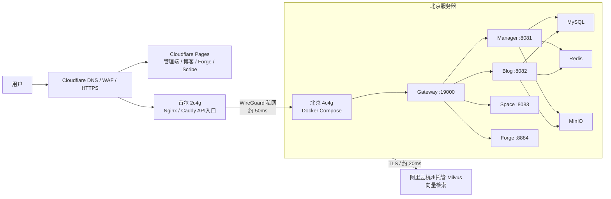

# Nebula 当前部署架构

## 1. 适用范围

本文档用于当前开源示例项目的部署，不以高可用、异地容灾或数据恢复为目标。当前约束如下：

- 北京服务器：`4c4g`。
- 首尔服务器：`2c4g`。
- 域名使用 Cloudflare，暂不考虑 ICP 备案。
- 阿里云杭州提供免费的托管 Milvus 测试实例，容量 `5GB`。
- 首尔到北京延迟约 `50ms`，北京到杭州 Milvus 延迟约 `20ms`。
- 不部署 Nacos，不做两地双活，不做异地备份。

## 2. 总体拓扑



### 2.1 首尔服务器

首尔服务器只承担公网入口职责：

- Cloudflare 的源站。
- Nginx 或 Caddy。
- API 请求转发到北京 Gateway。
- 可选：保存少量运维脚本和临时构建文件。

首尔不运行 MySQL、Redis、MinIO 或完整 Java 服务栈，以避免 `2c4g` 内存不足。

### 2.2 北京服务器

北京服务器是应用和数据节点，使用 Docker Compose 运行：

- `nebula-service-gateway`：`19000`。
- `nebula-service-manager`：`8081`。
- `nebula-service-blog`：`8082`。
- `nebula-service-space`：`8083`。
- `nebula-service-forge`：`8884`。
- MySQL、Redis、MinIO。

只有 Gateway 接受来自首尔 WireGuard 网络的请求。其他服务、数据库和对象存储只加入 Docker 内部网络，不开放公网端口。

### 2.3 杭州托管 Milvus

杭州只提供 Milvus 向量存储和检索，不在北京或首尔自建 Milvus。北京应用通过阿里云提供的 TLS Endpoint 访问它。

项目当前默认 embedding 维度为 `1536`，必须与 Milvus collection 的向量维度一致。首次启动可以开启 collection、索引和 alias 的自动初始化；修改 embedding 模型或维度时，必须按项目的 Milvus 迁移流程重建 collection，不能直接覆盖旧维度。

## 3. 前端部署

前端不放在北京或首尔的 Java 容器中，使用 Cloudflare Pages。当前仓库中有多个独立前端，建议为每个前端建立一个 Pages 项目，绑定同一个 GitHub monorepo：

| Pages 项目 | Root directory | Build command | 输出目录 |
|---|---|---|---|
| 管理端 | `ui/nebula-ui` | `pnpm build:ele` | `apps/web-ele/dist` |
| 博客前台 | `ui/nebula-blog-ui` | `pnpm build` | `dist` |
| Forge | `ui/nebula-forge` | `pnpm build` | `dist` |
| Scribe | `ui/nebula-scribe` | `pnpm build` | `dist` |

建议使用独立子域名：

```text
admin.example.com   -> 管理端 Pages
www.example.com     -> 博客 Pages
forge.example.com   -> Forge Pages
scribe.example.com  -> Scribe Pages
api.example.com     -> 首尔 Nginx
```

每次前端代码 `git push` 后，Cloudflare Pages 自动安装依赖、构建并发布静态文件，不需要重启服务器，也不建议把 `dist` 提交到 GitHub。

每个 Pages 项目使用 Node.js 20 和 pnpm 10.33.0。前端只配置公开变量，例如 `VITE_GLOB_API_URL`；数据库密码、MinIO 密钥、Milvus Token 和 AI Key 只能放在北京后端环境变量中。

## 4. API 和网络访问

推荐让前端统一请求：

```text
https://api.example.com
```

链路如下：

```text
浏览器 -> Cloudflare -> 首尔 Nginx -> WireGuard -> 北京 Gateway:19000
```

也可以继续使用项目生产环境中的相对路径 `/api`，但必须在每个前端域名上配置 `/api/*` 到首尔 Nginx 的转发规则。使用独立的 `api.example.com` 更容易统一管理 CORS、Cookie 和日志。

公网只开放首尔的 `80/443`。北京服务器的业务端口、数据库和 MinIO 端口不暴露公网：

```text
19000、8081、8082、8083、8884
13306、16379、9000、9001
```

首尔和北京之间使用 WireGuard 私网，首尔 Nginx 只允许转发到北京 Gateway。SSH 使用密钥登录并限制来源 IP。

## 5. Docker 构建和部署

北京服务器可以直接完成后端构建和部署：

```text
拉取 GitHub 代码
    -> Maven 构建各服务 JAR
    -> 构建 Docker 镜像
    -> docker compose up -d
```

每个 Java 服务一个容器，依赖服务使用 Compose service name 访问：

```text
MYSQL_HOST=mysql
REDIS_HOST=redis
MINIO_ENDPOINT=minio:9000
```

不能在容器中使用 `127.0.0.1` 访问另一个容器。

由于北京只有 `4c4g`，首次部署建议先启动 Gateway、Manager、Blog、MySQL、Redis、MinIO，再按实际需要启动 Space 和 Forge。Maven 构建和多个镜像不要并行执行，避免构建阶段耗尽内存。

Java 容器需要限制堆内存，例如：

```yaml
environment:
  JAVA_TOOL_OPTIONS: "-Xms128m -Xmx384m"
```

具体内存上限需根据启动日志和运行时占用调整，并为系统、Docker、MySQL 和 MinIO 预留空间。可以配置适量 swap，但 swap 只用于缓冲内存峰值，不能替代扩容。

## 6. MinIO 部署

MinIO 放在北京，与业务服务同机或同一 Docker 网络。建议使用两个桶：

```text
nebula  私有桶，后端生成预签名 URL
public  公开桶，只允许匿名读取
```

MinIO 管理控制台 `9001` 只能通过 WireGuard 或 SSH 隧道访问，不能暴露公网。文件访问使用独立域名：

```text
s3.example.com -> Cloudflare -> 首尔 Nginx -> WireGuard -> 北京 MinIO
```

项目会根据 MinIO Endpoint 生成预签名 URL，因此必须确认：

- 后端能够连接 MinIO。
- 返回给浏览器的 URL 使用可公开访问的域名。
- 签名生成的 Host 与浏览器实际访问的 Host 一致。
- Cloudflare 不缓存私有预签名文件。

如果当前代码无法同时区分内部 Endpoint 和公开 URL 域名，先使用同一个可访问域名完成验证，再考虑增加内外部 Endpoint 配置。

## 7. Milvus 配置

不要把阿里云 Milvus 的 `19530` 直接暴露到公网，也不要把 Attu 的 `8000` 当作应用连接端口。应用使用阿里云控制台提供的 TLS Endpoint、Token 和数据库名：

```text
MILVUS_ENABLED=true
MILVUS_URI=https://阿里云提供的Endpoint:443
MILVUS_TOKEN=阿里云控制台Token
MILVUS_DATABASE=default
MILVUS_SECURE=true
```

阿里云白名单放行北京服务器的公网出口 IP。当前代码支持 `uri + token` 连接模式；如果某个服务的 `application.yml` 还只声明了 `host/port`，需要在部署配置中补齐对应的 `uri` 配置，并保持使用 RAG 的服务配置一致。

## 8. 不采用的方案

- 不部署 Nacos：当前服务数量和规模不足以抵消注册中心、配置中心、权限和运维成本。
- 不做两地双活：MySQL、Redis、MinIO 和 Milvus 的跨地域一致性会显著增加复杂度。
- 不在 `2c4g` 首尔服务器自建完整后端和 Milvus。
- 不在北京 `4c4g` 上自建 Milvus：阿里云托管实例已满足测试需要。
- 不把数据库、Redis、MinIO 或后端业务端口暴露到公网。

## 9. 已接受的风险

这是一个单活、无备份的示例项目架构：

- 北京服务器故障会导致后端、数据库和文件服务同时不可用。
- 首尔到北京的 WireGuard 链路故障会导致公网 API 不可用。
- MySQL 或 MinIO 数据损坏后没有恢复保障。
- 所有 API 请求会增加首尔到北京约 `50ms` 的网络延迟。
- Milvus 查询链路约为北京到杭州 `20ms`，明显优于首尔直连杭州的 `200ms+`。

这些风险在开源示例项目范围内可以接受；如果后续转为生产业务，应重新评估备份、监控、扩容、数据库托管和多节点部署。

## 10. 上线检查清单

- [ ] Cloudflare Pages 的多个项目构建成功，子域名绑定正确。
- [ ] 前端 API 地址指向 `api.example.com` 或已配置 `/api` 反向代理。
- [ ] 首尔只开放 `80/443`，Nginx/Caddy 可访问北京 Gateway。
- [ ] WireGuard 两端稳定，配置 Keepalive 和自动重连。
- [ ] 北京 Docker Compose 服务健康检查通过。
- [ ] Java、MySQL、Redis、MinIO 的内存占用可接受。
- [ ] MinIO 私有桶预签名 URL 和公开桶 URL 均可从浏览器访问。
- [ ] 阿里云 Milvus 白名单包含北京出口 IP。
- [ ] Milvus TLS、Token、database 和 embedding 维度配置正确。
- [ ] 未将密码、Token、AI Key 和生产 `.env` 提交到 GitHub。
- [ ] 已明确接受无备份和单点故障风险。
